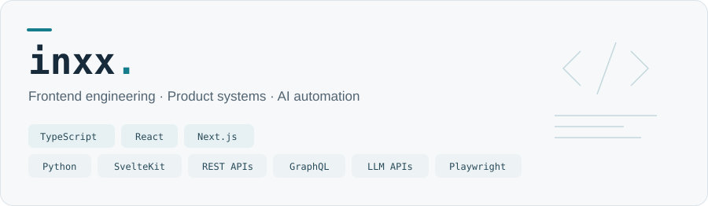
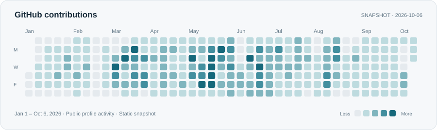

I turn everyday workflows into web products and tools people can use. Over a decade in web development, with a foundation in frontend engineering.

### What I build

| Product interfaces | Everyday tools | AI-assisted applications |
| :--- | :--- | :--- |
| Commerce, admin platforms and partner-facing tools. | Self-service content tools and workflow automation. | LLM-powered tools and knowledge search with source-linked responses. |
| Reusable interfaces and shared components. | Small prototypes shaped by user feedback. | Retrieval, reranking and human review. |

### How I work

Start with the user's actual workflow. Make edge cases and failure states explicit. Improve incrementally, with shared specifications and tests to support collaboration.

### Currently exploring

**Agentic development workflows** · **AI-assisted software delivery**  
Developer productivity, AI-native internal tools and human-in-the-loop systems.

### Activity

Publicly visible GitHub contribution activity, captured 2026-10-06. This is a static snapshot; it is not a count of public-repository commits only.

---

**Structured profile** · [profile.json](https://github.com/inxx/inxx/blob/main/profile.json) · [Raw JSON](https://raw.githubusercontent.com/inxx/inxx/main/profile.json)
